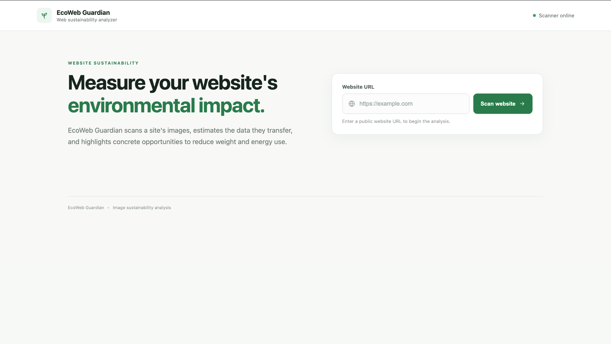
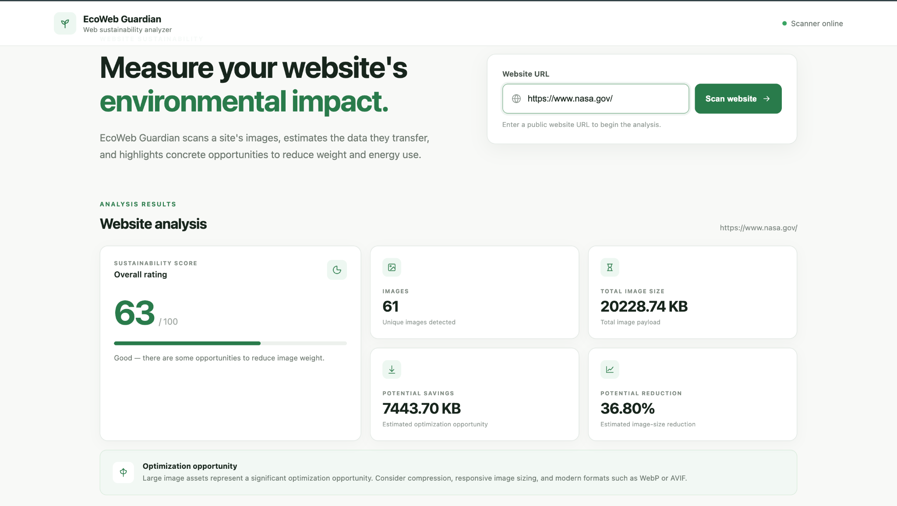

# 🌱 EcoWeb Guardian

> **Measure your website's environmental impact.**

EcoWeb Guardian is a web sustainability analyzer that evaluates the environmental impact of websites by analyzing their image payload, estimating optimization opportunities, and generating a sustainability score.

The goal is simple: **help developers understand how website assets contribute to digital energy usage and identify practical ways to make websites lighter and more sustainable.**

---

## 🚀 Overview

Modern websites rely heavily on images and other digital assets. Large and unoptimized images increase the amount of data transferred to users, which can contribute to higher energy consumption.

**EcoWeb Guardian** provides a simple way to analyze a public website and understand:

- 🖼️ Number of images detected
- 📦 Total image payload
- 💾 Potential data savings
- 📉 Estimated image-size reduction
- 🌿 Overall sustainability score
- 💡 Optimization opportunities

---

## ✨ Features

### 🌿 Sustainability Score

Generates an overall score out of **100** based on the website's image-related sustainability metrics.

### 🖼️ Image Analysis

Detects and counts images present on the analyzed website.

### 📦 Image Payload Analysis

Calculates the total size of the detected image assets.

### 💾 Potential Savings

Estimates how much data could potentially be saved through image optimization.

### 📉 Reduction Estimation

Calculates the estimated percentage reduction achievable through optimization.

### 💡 Optimization Recommendations

Highlights optimization opportunities and suggests techniques such as:

- Image compression
- Responsive image sizing
- Modern image formats
- WebP
- AVIF

---

## 🖥️ Dashboard

The EcoWeb Guardian dashboard provides a clean sustainability-focused interface where users can enter a public website URL and analyze it.

### Landing / Scanner Interface



Users can enter a public website URL and start the sustainability analysis using the **Scan Website** button.

---

### Analysis Dashboard



After scanning, the dashboard presents key sustainability metrics including:

- Sustainability Score
- Number of Images
- Total Image Size
- Potential Savings
- Potential Reduction
- Optimization Opportunities

---

## 📊 Example Analysis

Example website analyzed:

**https://www.nasa.gov/**

Example results:

| Metric | Result |
|---|---:|
| 🌿 Sustainability Score | **63 / 100** |
| 🖼️ Images Detected | **61** |
| 📦 Total Image Size | **20,228.74 KB** |
| 💾 Potential Savings | **7,443.70 KB** |
| 📉 Potential Reduction | **36.80%** |

> These values are example results generated during a website analysis and may vary depending on the website's current content.

---

## 🏗️ Project Structure

```text
EcoWeb-Guardian/
│
├── backend/
│   ├── src/
│   │   └── scanner.js
│   │
│   ├── server.js
│   ├── package.json
│   └── package-lock.json
│
├── frontend/
│   ├── index.html
│   ├── style.css
│   └── script.js
│
├── .gitignore
├── LICENSE
└── README.md
